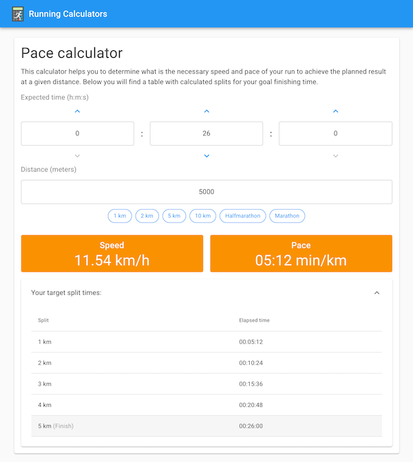

#  Running Calculators

The collection of calculators that helps you to plan your race.

## Demo

https://rwilinski.github.io/running-calculators/

## Screenshot



## Features

- Calculate required speed and pace to complete your run in specific time.
- Generate table with split times.
- Calculate finish time by providing your pace and distance.
- Calculate distance based on your pace and time.

## Installation

```bash
# Clone this repository
git clone https://github.com/rwilinski/running-calculators.git

# Go to project directory
cd running-calculators

# Install all dependencies
npm install
```

## Usage

### `npm start`

Runs the app in the development mode.<br>
Open [http://localhost:3000](http://localhost:3000) to view it in the browser.

### `npm test`

Launches the test runner in the interactive watch mode.<br>
See the section about [running tests](https://facebook.github.io/create-react-app/docs/running-tests) for more information.

### `npm run build`

Builds the app for production to the `build` folder.<br>
It correctly bundles React in production mode and optimizes the build for the best performance.

### `npm run deploy`

Publish to a `gh-pages` branch on GitHub.<br>
See [gh-pages](https://github.com/tschaub/gh-pages) documentation for more information.

## PWA

This project supports **Progressive web application** (PWA). You can install it on your device and use it even when offline. Just click "**Add to home screen**" in your browser's settings.

## Notes

Bootstrapped with [Create React App](https://github.com/facebook/create-react-app).
